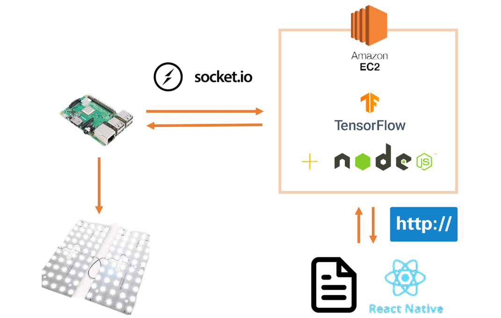
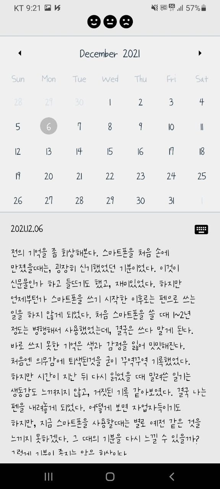
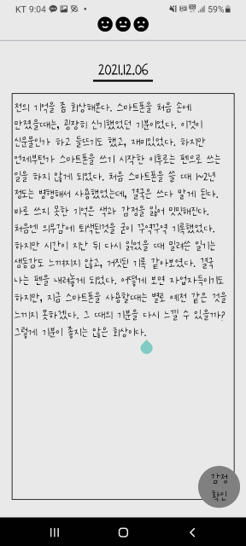
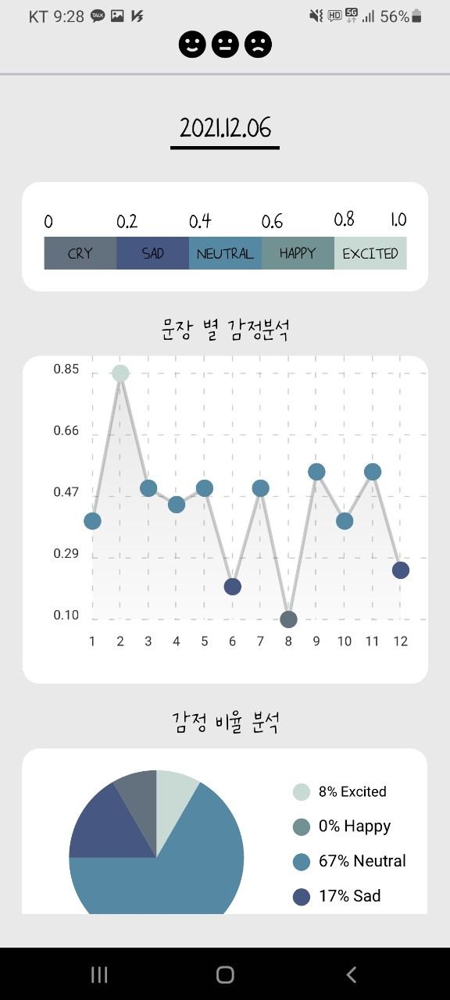
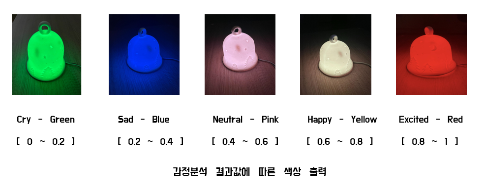

# Smart Mood Lamp
> 작성한 일기를 바탕으로 감정을 분석하여, 기분에 따라 무드등의 색을 변경해주는 IoT 프로젝트 입니다.

사용자는 일기를 작성하면서 하루를 마무리함과 동시에, 자신의 감정 분석 결과를 핸드폰에서 바로 확인할 수 있습니다. 또한 컬러테라피가 가능한 색상으로 무드등을 조절하여 사용자의 하루에 위안이 될 수 있는, <b>기술과 감성을 융합한 IoT 제품</b>을 만들고자 하였습니다.

## Environment
* [React Native](https://reactnative.dev/)
* [Node.js](https://nodejs.org/ko/)
* [Tensorflow](https://www.tensorflow.org/?hl=ko)
* Google APIs
* Git

## Project Architecture

* 하드웨어는 1개의 스마트폰, 1개의 라즈베리파이, 1개의 무드등으로 구성됩니다.
* 사용자가 앱을 통해 일기를 작성하면, 그 텍스트를 node.js 서버로 전달합니다.
* node.js 서버가 텍스트를 받고, 텐서플로우를 이용해 감정 분석을 진행합니다.
* 감정 분석결과를 프론트엔드와 라즈베리파이에 전달합니다.
* 무드등은 감정 분석 결과를 토대로 적절한 색을 설정합니다.

 

## Interface
### Input Interface - 안드로이드 어플리케이션
 

> 사용자의 무채색인 일상에 색깔을 추가한다는 큰 의미를 담아 UI의 전체적인 색상을 회색계열로 선정하고, 분석된 감정은 각각의 고유한 색상을 가지도록 디자인하였습니다.

 

  

 

1. 스플래시 화면 로딩 후, 메인화면에서 달력을 통해 사용자가 원하는 날짜를 선택
2. 날짜 선택 후 키보드 모양의 버튼을 누르면 일기 작성 페이지로 이동
3. 일기를 작성한 후, ‘감정 확인’ 버튼을 누르면 axios를 이용한 http 통신을 이용해 서버로 요청을 보내고, 작성한 일기는 sqlite를 이용해 로컬저장소에 저장
4. 서버로부터 응답이 오면, 결과 화면으로 이동
5. 서버로부터 받은 감정 분석 결과를 바탕으로 ‘문장 별 감정’을 나타내는 Line chart와, ‘감정 비율’을 나타내는 Pie chart를 그림

 

### Output Interface - 무드등 (네오픽셀)

## 참여하기
이 프로젝트는 오픈소스입니다. 프로젝트에 기여해주세요🥳
1. 이 프로젝트를 fork해주세요.
2. 새 branch를 생성해주세요. `git checkout Update`
3. 새 branch에서 작업을 진행하고, 변경사항을 commit해 주세요. `git commit -m "New Update`
4. 생성한 branch에 push해 주세요. `git push origin Update`
5. merge request를 요청해주세요. 당신의 request를 기다립니다!

 

## Contact
wish@khu.ac.kr

